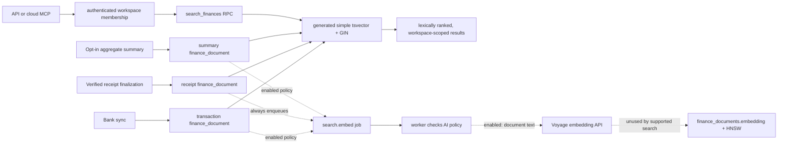

# Search and Retrieval Semantics

**Status:** Accepted, 2026-09-13
**Scope:** Finch's supported Supabase search path and the legacy SQLite search
implementation retained for cutover work.

## Decision

Finch's supported product search is workspace-scoped lexical search over
`finance_documents`. It uses PostgreSQL `websearch_to_tsquery('simple', ...)`,
`ts_rank_cd`, and a bounded result count. It does **not** currently use dense
vectors, hybrid/RRF fusion, reranking, distillation, line-item burst, or
retrieval freshness.

Embeddings are not a released search capability yet. Until the adoption gates
below are met, deployments must leave workspace AI policies disabled rather
than send financial document text to an external embedding provider for a
write-only index.

Do not add a freshness boost, age decay, RRF weights, candidate-window tuning,
or LLM reranking now. The current fixture is a smoke test, not relevance
evidence. Financial-time rules remain in
[`temporal-semantics.md`](./temporal-semantics.md): index-write time is never
financial evidence and may only become an explicitly evaluated retrieval
feature.

## Supported Flow Today

| Stage | Current behavior | Required boundary |
| --- | --- | --- |
| Materialization | Bank sync writes transaction text from booking date, amount, currency, merchant/counterparty, and raw description. Receipt finalization writes only verified receipt metadata; summaries write generated aggregate text. `account` is allowed by the schema but has no current producer. | Never put receipt originals, Storage keys, Vault IDs, provider sessions, credentials, or opaque bank references in `finance_documents.content`. |
| Query | `GET /api/search` validates a nonblank query up to 500 characters and a limit from 1–50, then calls `search_finances`. The cloud MCP forwards to the same API. | `requireWorkspace`, `security invoker`, RLS, and the RPC's workspace predicate all scope results to an active member workspace. |
| Lexical rank | `search_finances` uses `websearch_to_tsquery('simple', p_query)` and `ts_rank_cd`, ordered by rank then document ID. | Treat rank as an ordering value, not a calibrated relevance probability. |
| Embedding side path | `search.embed` reads the document, uses the workspace policy, calls Voyage with `input_type: "document"`, and stores a 1024-dimensional vector. | It is external processing of source-derived financial text and requires an explicit, revocable policy. |
| Deletion | Workspace purge deletes `finance_documents`; no supported per-document deletion path exists. | A future source deletion must delete/clear the associated searchable document and vector atomically enough that stale records cannot be returned. |

## Findings Requiring Remediation

1. **High — cloud embeddings are write-only.**
   `worker-run` writes `finance_documents.embedding`, but the only supported
   query (`public.search_finances`) is lexical. There is no cloud query-vector
   generation, vector nearest-neighbor query, RRF fusion, or reranker caller.
   Enabling an AI policy currently transmits financial text to Voyage without
   changing search results.

2. **High — AI-policy revocation and model changes do not reconcile existing
   vectors.** `set_workspace_ai_policy` only increments `policy_version`.
   It neither clears all existing embeddings when disabled nor enqueues a
   complete re-embedding when provider/model/version changes. The worker clears
   a vector only when a job happens to run for that document.

3. **High — an older embedding job can overwrite a newer document revision.**
   `embedDocument` reads `id,content`, calls Voyage, then checks only policy
   mode/version before updating. It does not carry or compare the document
   `content_hash` at write time. A delayed/retried old job can therefore write
   a vector for old content after a newer job completes.

4. **Medium — AI policy accepts configurations the worker cannot serve.** The
   SQL policy function accepts arbitrary provider/model text, while the worker
   supports only `voyage` and rejects any response other than 1024 dimensions.
   An unsupported administrator-selected policy dead-letters embedding jobs.

5. **Medium — cloud document `updated_at` is not maintained on upsert.**
   `finance_documents` has no touch trigger and its materializers do not set
   `updated_at` in their conflict-update payload. It cannot currently mean
   “last projection/index write”; do not use it for freshness, diagnostics, or
   reconciliation until corrected.

6. **Medium — supported cloud search lacks direct regression coverage.**
   Existing Supabase tests verify receipt document creation and job enqueueing,
   but none exercise `/api/search` or `search_finances` for query parsing,
   ranking determinism, limits, or cross-workspace isolation. The synthetic
   local eval has 13 separable cases and explicitly cannot support a quality
   claim.

7. **Low — the query-text limit exists only at the Edge route.**
   `search_finances` clamps `p_limit`, but the SQL function has no matching
   length check for `p_query`; authenticated callers granted direct RPC access
   can bypass the API's 500-character cap. Keep the API as the intended surface
   and add the same database-side bound before relying on it for cost control.

### Legacy SQLite Cutover Debt

The README declares SQLite/MCP non-deployable legacy code. Do not
extend it to solve cloud search gaps. Record these defects in the cutover work:

- `DocumentEmbedWorker` has no production caller; local jobs are not a
  supported cloud worker path.
- `LineItemBurstLive` writes formatted IDs such as `receipt:r-1:line:0` into
  `embeddings.documentId`, although that FK references the UUID
  `search_documents.id`. Its test disables foreign keys, and the resulting ID
  cannot be resolved by `HybridSearch` as a normal source row.
- Local vec0 lookup filters tenant but not model. A future local model change
  can mix incomparable vectors.
- Removing a local search document does not remove its vec0 row; only the
  relational embedding row cascades. Stale vector hits are later skipped, but
  consume candidate slots.
- Local distillation and reranking interpolate untrusted bank/receipt text into
  LLM prompts. No public runtime may enable those LLM steps without a threat
  model and adversarial tests.
- `tests/search/**/*.test.ts` is excluded by both normal Vitest configurations;
  its suite is not part of `bun run verify`.

## Semantic-Retrieval Adoption Gates

Implement semantic/hybrid search only as one reviewed slice, not as an
embedding-only rollout:

1. **Policy and lifecycle.** Allowlist provider/model/dimensions; make policy
   enablement explicitly disclose source-derived text sent externally; clear
   vectors on disable; enqueue/version a complete backfill on change; and
   write vectors only when both policy version and document content hash still
   match the job.
2. **Retrieval contract.** Add one authenticated cloud endpoint/RPC that
   creates a query vector with the same approved model, filters by workspace,
   model, policy version, and non-null vector, and returns deterministic
   diagnostics. Never query a vector under a different model revision.
3. **Index correctness.** Test HNSW recall under tenant/model filters, stale
   jobs, retries, source updates/deletes, policy revocation, and no-result
   handling. pgvector applies filters after an approximate scan, so enough
   candidates/iterative scans must be measured rather than guessed.
4. **Quality evidence.** Build a reviewed, access-safe query/relevance corpus
   from real product intents. Report recall@K, MRR, precision/NDCG as suitable,
   latency, failures, and cohort regressions. Only then evaluate fixed RRF
   (`k = 60`, equal weights is the existing legacy baseline) against lexical
   and dense alone.
5. **LLM stages last.** Keep reranking and distillation off until candidates
   are isolated as untrusted data, outputs are schema-validated, errors fail
   closed to the prior ranking, and prompt-injection tests demonstrate no
   unauthorized disclosure or action. They must never decide reconciliation,
   payments, or other financial state.

## Why This Boundary

PostgreSQL documents `websearch_to_tsquery` as suitable for raw user input and
non-throwing on malformed web-style queries; its GIN index is the preferred
text-search index. That supports the current bounded lexical path without a
new dependency or ranking scheme.

Voyage documents `voyage-finance-2` as a 1024-dimensional finance-retrieval
model and recommends distinct `query`/`document` input types. That validates
the stored vector shape, but it does not make an unused embedding index a
product feature. pgvector documents that HNSW is approximate and that filtered
queries can return fewer results unless recall is measured and scan behavior
is configured.

RRF is appropriate only when two independently ranked candidate sets exist;
the legacy implementation's formula and `k = 60` match the published baseline.
It is not applicable to the current one-channel cloud API. OWASP identifies
tenant isolation, embedding access control, poisoned retrieval content, and
indirect prompt injection as separate risks; financial text remains untrusted
input to any future model stage.

## Sources

- PostgreSQL, [Controlling Text Search](https://www.postgresql.org/docs/current/textsearch-controls.html): `websearch_to_tsquery`, ranking behavior, and raw-input safety.
- PostgreSQL, [Preferred Index Types for Text Search](https://www.postgresql.org/docs/current/textsearch-indexes.html): GIN as the preferred text-search index.
- Voyage AI, [Text Embeddings](https://docs.voyageai.com/docs/embeddings): `voyage-finance-2`, dimensions, and query/document input types.
- pgvector, [README](https://github.com/pgvector/pgvector): HNSW approximation, filtered-query recall, multitenancy, and hybrid-search guidance.
- Elastic, [Reciprocal Rank Fusion](https://www.elastic.co/guide/en/elasticsearch/reference/current/rrf.html): rank-only fusion formula, equal weights, and default rank constant 60.
- SQLite, [FTS5 Extension](https://www.sqlite.org/fts5.html): local FTS query syntax, tokenization, and index-consistency requirements.
- OWASP, [LLM08: Vector and Embedding Weaknesses](https://genai.owasp.org/llmrisk/llm082025-vector-and-embedding-weaknesses/): permission-aware vector stores and multi-tenant leakage risk.
- OWASP, [LLM01: Prompt Injection](https://genai.owasp.org/llmrisk/llm01-prompt-injection/): untrusted-content isolation and adversarial testing.
